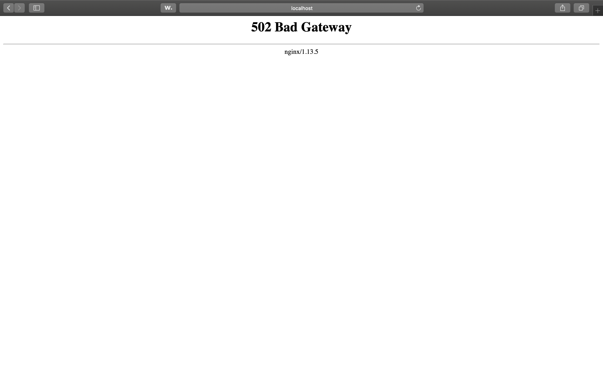
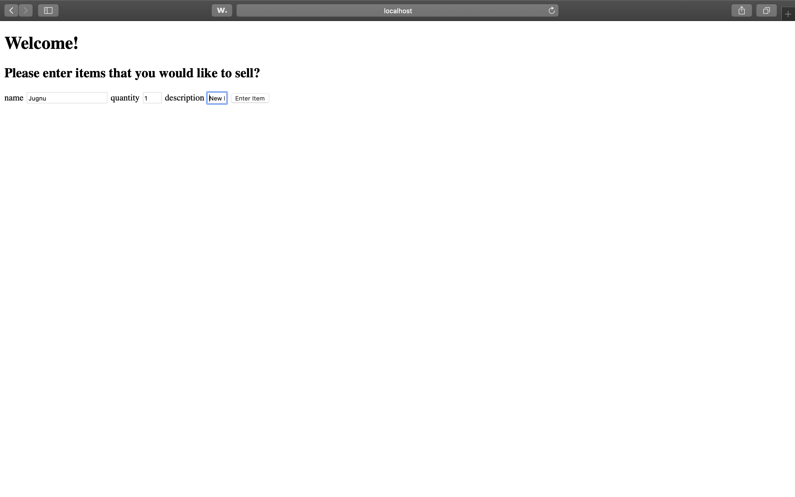

# [Please click here for the solution explanation](README.md#solution)

# Insight DevOps Engineering Systems Puzzle

## Table of Contents
1. [Understanding the puzzle](README.md#understanding-the-puzzle)
2. [Introduction](README.md#introduction)
3. [Puzzle details](README.md#puzzle-details)
4. [Instructions to submit your solution](README.md#instructions-to-submit-your-solution)
5. [FAQ](README.md#faq)
6. [Solution](README.md#solution)

# Understanding the puzzle

We highly recommend that you take a few dedicated minutes to read this README in its entirety before starting to think about potential solutions. You'll probably find it useful to review the codebase and understand the system at a high-level before attempting to find specific bugs.

# Introduction

Imagine you're on an engineering team that is building an eCommerce site where users can buy and sell items (similar to Etsy or eBay). One of the developers on your team has put together a very simple prototype for a system that writes and reads to a database. The developer is using Postgres for the backend database, the Python Flask framework as an application server, and nginx as a web server. All of this is developed with the Docker Engine, and put together with Docker Compose.

Unfortunately, the developer is new to many of these tools, and is having a number of issues. The developer needs your help debugging the system and getting it to work properly.

# Puzzle details

The codebase included in this repo is nearly functional, but has a few bugs that are preventing it from working properly. The goal of this puzzle is to find these bugs and fix them. To do this, you'll have to familiarize yourself with the various technologies (Docker, nginx, Flask, and Postgres). You definitely don't have to be an expert on these, but you should know them well enough to understand what the problem is.

Assuming you have the Docker Engine and Docker Compose already installed, the developer said that the steps for running the system is to open a terminal, `cd` into this repo, and then enter these two commands:

    docker-compose up -d db
    docker-compose run --rm flaskapp /bin/bash -c "cd /opt/services/flaskapp/src && python -c  'import database; database.init_db()'"

This "bootstraps" the PostgreSQL database with the correct tables. After that you can run the whole system with:

    docker-compose up -d

At that point, the web application should be visible by going to `localhost:8080` in a web browser. 

Once you've corrected the bugs and have the basic features working, commit the functional codebase to a new repo following the instructions below. As you debug the system, you should keep track of your thought process and what steps you took to solve the puzzle.

## Instructions to submit your solution
* Don't schedule your interview until you've worked on the puzzle 
* To submit your entry please use the link you received in your systems puzzle invitation
* You will only be able to submit through the link one time
* For security, we will not open solutions submitted via files
* Use the submission box to enter the link to your GitHub repo or Bitbucket ONLY
* Link to the specific repo for this project, not your general profile
* Put any comments in the README inside your project repo

# FAQ

Here are some common questions we've received. If you have additional questions, please email us at `devops@insightdata.com` and we'll answer your questions as quickly as we can (during PST business hours), and update this FAQ. Again, only contact us after you have read through the Readme and FAQ one more time and cannot find the answer to your question.

### Which Github link should I submit?
You should submit the URL for the top-level root of your repository. For example, this repo would be submitted by copying the URL `https://github.com/InsightDataScience/systems-puzzle` into the appropriate field on the application. **Do NOT try to submit your coding puzzle using a pull request**, which would make your source code publicly available.

### Do I need a private Github repo?
No, you may use a public repo, there is no need to purchase a private repo. You may also submit a link to a Bitbucket repo if you prefer.

### What sort of system should I use to run my program (Windows, Linux, Mac)?
You should use Docker to run and test your solution, which should work on any operating system. If you're unfamiliar with Docker, we recommend attending one of our Online Tech Talks on Docker, which you should've received information about in your invitation. Alternatively, there are ample free resources available on docker.com.

### How will my solution be evaluated?
While we will review your submission briefly before your interview, the main point of this puzzle is to serve as content for discussion during the interview. In the interview, we'll evaluate your problem solving and debugging skills based off how you solved this puzzle, so be sure to document your thought process.

### This eCommerce site is ugly...should I improve the design?  
No, you should focus on the functionality. Your engineering team will bring on a designer and front-end developer later in the process, so don't worry about that aspect in this puzzle. If you have extra time, it would be far better to focus on aspects that make the code cleaner and easier to use, like tests and refactoring.

### Should I use orchestration tools like Kubernetes?
While technologies like Kubernetes are quite powerful, they're likely overkill for the simple application in this puzzle. We recommend that you stick to Docker Compose for this puzzle.

# Solution
The very first step that I did is, I cloned this repo to my local machine and tried running it using the above mentioned commands. When I opened the `localhost:8080` on my browser, there was no such page. Then, I started analysing the given sample code and soon I found out the first bug in the Dockerfile.

1. On line 25 in the Dockerfile, the ports were exposed in the form `80:8080` which actually should be `8080:80`. In docker, the the first port number before the `:` is called the host port whereas the 2nd port number is called the container port. So, when the exposed ports was `80:8080`, it actually exposed the 8080 port of the container to the port 80 on my local machine. There is nothing linked to the port 8080 of the nginx container and there is no port exposure on 8080 of my local machine. Hence, I wasn't able to access the website on `localhost:8080` on my local machine. Instead, if I had used `localhost:80`, I would have been able to access the page. However, for the simplicity of this puzzle, we need to open the page on port 8080, I interchanged the values such that the port 80 of the nginx container gets exposed to the 8080 port of my local machine. Also, I exposed the port 80 of the nginx container to 8080 of my local machine because the default port of nginx container is 80.

2. Once I had the port exposure issue fixed, I ran the Dockerfile again. This time, the ports were exposed correctly as I was able to get the some output on my `localhost:8080`. But, it threw a Gateway error of 502 as below:

  

* This gave me an assurity that the server side error means I have to solve an issue in the webpage code. I explored the web to make myself familiar with how Flask works and how to expose flask page on docker. The app.py page had all the necessary commands too display the required page on the webpage on `localhost:8080`. This didn't solve my problem as there was some error in retreiving the page onto the nginx server.
* After a deep debugging of the flask app code, I found out that in the `app.run` command in the last line of `app.py` file, the host-ip is mentioned as `0.0.0.0` which is localhost, but there is no port number added onto it. All I had to do is add the port number of the page to the ip-address and I would have the output of the page on `localhost:8080`. But adding port 8080 won't solve the problem here. The port 8080 is just the port that connects my local machine to the nginx docker.
* How this application works is: the database container `db` is connected to the `flask` container and the `flask` container is connected to the `nginx` container.
* So, it forms a network of A->B->C where A, B and C are `nginx`, `flask` and `postgres` respectively. What the app already did was, it connected all these 3 docker containers, but the nginx port had nothing to display as nothing was linked to it's port `80`.
* In order to resolve this, I added the port number of the flask container to the app.run command.
`app.run(host='0.0.0.0', port=5001)`

This exposed the `flask` container onto the `nginx` container, which in-turn was exposed on port `8080` of my local machine.

* After making these changes, I recomposed the Dockerfile and this time I was successfully able to link all the containers together and I got the output.

  

3. After entering the values, the page doesn't redirect to a new page with results because there is no html page designed in the app for the `/success` path. However, the `app.py` page does have the code to return the string of the input. I added the link to the submit button to call the `/success` function when the button is clicked. We can check the data stored in the `db` container by exposing the port of the postgresql container and accessing it on local machine.

The puzzle was a good brainstorming exercise for me and I believe that the sole purpose of this puzzle was to get the deep knowledge of how container networks work and how to interconnect them to make them act as one application. I thank Insight for such good puzzle that helped me understand the concepts of docker networking in-depth.

### This is a solution for the [Systems Puzzle](https://github.com/InsightDataScience/systems-puzzle) by [Jugnu Misal](https://github.com/jugnumisal) attempted on 25 Nov 2019.